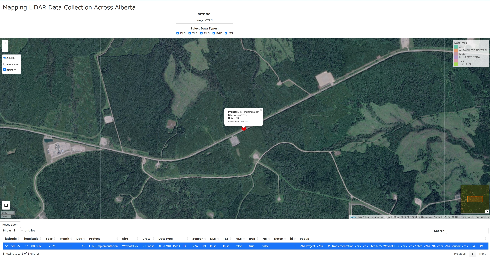

# Alberta LiDAR Data Collection Explorer

This Shiny web application visualizes LiDAR sensor deployments across Alberta, Canada. Users can interactively explore data collected from different sensors (DLS, TLS, MLS, RGB, MS) across various sites.

## 🌐 Live Demo

[https://ergin.shinyapps.io/lidar_ab/](https://ergin.shinyapps.io/lidar/)

---

---

## 📂 Project Structure

/your-repo
│
├── app.R
├── www/
│   ├── DATA_SETS_DATABASE.xlsx
│   ├── spatial/
│   │   ├── AB_Boundry.shp
│   │   ├── ecoregions_ab.shp
│   └── style.css
└── README.md

---

📋 Features

Interactive leaflet map showing sensor deployments

Overlay of Alberta's ecoregions and provincial boundaries

Filter by site number and sensor type

Interactive data table linked to map markers

Custom zoom reset, minimap, legend, and measure tools

---

## 📦 Dependencies

The application relies on the following R packages:

library(shiny)
library(leaflet)
library(DT)
library(readxl)
library(dplyr)
library(raster)
library(sf)
library(rgdal)
library(RColorBrewer)

⚠️ Note: Make sure all shapefiles (.shp, .dbf, .shx, etc.) are correctly placed under www/spatial/.

---

## 🚀 How to Run Locally

Clone the repository:

git clone https://github.com/yourusername/your-repo.git
cd your-repo

Open app.R in RStudio or your R environment.

Install the required packages (if not already installed).

---

## Run the app:

shiny::runApp()

📌 Notes

Ensure UTF-8 encoding compatibility for shapefile attributes.

For deployment, you may use rsconnect::deployApp() after logging in to your ShinyApps.io account.

---

## 📄 License

MIT License. See LICENSE for details.

